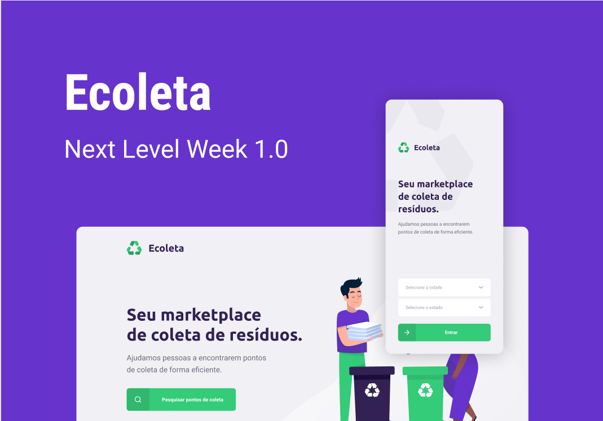

# Ecoleta

A *(☞ﾟヮﾟ)☞* **Rocketseat** *☜(ﾟヮﾟ☜)* realizou durante a primeira semana de junho de 2020 a edição 1.0 do **Next Level Week**, um treinamento online gratuito onde usamos **TypeScript** juntamente com a *stack* **Node.js**, **React** e **React Native** para criar o *backend* e *frontend* do aplicativo temático de coleta ecológica.

